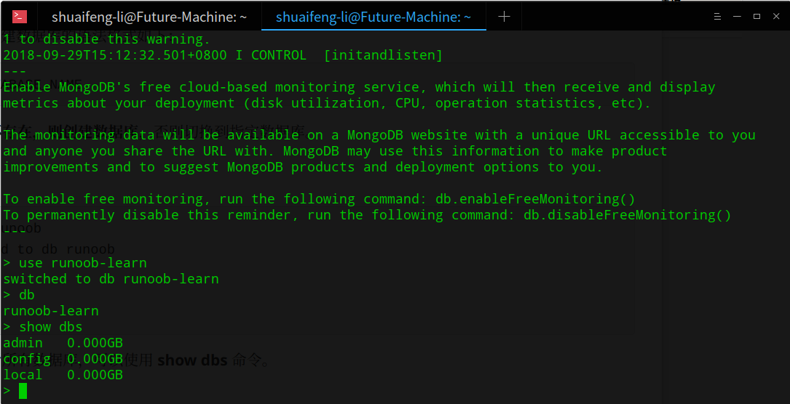

## MongoDB 创建数据库

### 语法

MongoDB 创建数据库的语法格式如下：

```
use DATABASE_NAME
```

**如果数据库不存在，则创建数据库**，否则切换到指定数据库。

### 实例

```
> use runoob
switched to db runoob
> db
runoob
> 
```

如果你想查看所有数据库，可以使用 **show dbs** 命令。



可以看到，我们刚创建的数据库 runoob 并不在数据库的列表中， 要显示它，我们需要向 runoob 数据库插入一些数据。

```
> db.runoob.insert({"name":"菜鸟教程"})
WriteResult({ "nInserted" : 1 })
```


## mongodb删除数据库

### 语法

MongoDB 删除数据库的语法格式如下：

```
db.dropDatabase()
```

删除当前数据库，默认为 test，你可以**使用 db 命令查看当前数据库名**。

接下来我们切换到数据库 runoob：

```
> use runoob
switched to db runoob
> 
```

执行删除命令：

```
> db.dropDatabase()
{ "dropped" : "runoob", "ok" : 1 }
```