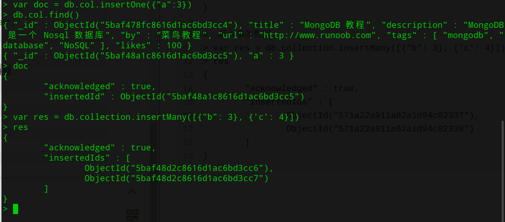

# MongoDB 插入文档

本章节中我们将向大家介绍如何将数据插入到MongoDB的集合中。

文档的数据结构和JSON基本一样。

所有存储在集合中的数据都是BSON格式。

**BSON是一种类json的一种二进制形式的存储格式,简称Binary JSON**。

## 方法一

MongoDB 使用 insert() 或 save() 方法向集合中插入文档，语法如下：

```
db.COLLECTION_NAME.insert(document)
```

### 实例

以下文档可以存储在 MongoDB 的 runoob 数据库 的 col 集合中：

```
>db.col.insert({title: 'MongoDB 教程', 
    description: 'MongoDB 是一个 Nosql 数据库',
    by: '菜鸟教程',
    url: 'http://www.runoob.com',
    tags: ['mongodb', 'database', 'NoSQL'],
    likes: 100
})
```

以上实例中 col 是我们的集合名，如果该集合不在该数据库中， MongoDB 会自动创建该集合并插入文档。

查看已插入文档：

```
> db.col.find()
{ "_id" : ObjectId("56064886ade2f21f36b03134"), "title" : "MongoDB 教程", "description" : "MongoDB 是一个 Nosql 数据库", "by" : "菜鸟教程", "url" : "http://www.runoob.com", "tags" : [ "mongodb", "database", "NoSQL" ], "likes" : 100 }
> 
```

我们也可以将数据定义为一个变量，如下所示：

```
> document=({title: 'MongoDB 教程', 
    description: 'MongoDB 是一个 Nosql 数据库',
    by: '菜鸟教程',
    url: 'http://www.runoob.com',
    tags: ['mongodb', 'database', 'NoSQL'],
    likes: 100
});
//这里如果不使用那个括号也是可以的
```

执行后显示结果如下：

```
{
        "title" : "MongoDB 教程",
        "description" : "MongoDB 是一个 Nosql 数据库",
        "by" : "菜鸟教程",
        "url" : "http://www.runoob.com",
        "tags" : [
                "mongodb",
                "database",
                "NoSQL"
        ],
        "likes" : 100
}
```

执行插入操作：

```
> db.col.insert(document)
WriteResult({ "nInserted" : 1 })
> 
```

插入文档你也可以使用 db.col.save(document) 命令。如果不指定 _id 字段 save() 方法类似于 insert() 方法。如果指定 _id 字段，则会更新该 _id 的数据。

## 方法二

**3.2 版本后还有以下几种语法可用于插入文档**:

-  db.collection.insertOne():向指定集合中插入一条文档数据
-  db.collection.insertMany():向指定集合中插入多条文档数据

### 实例

```
#  插入单条数据

> var document = db.collection.insertOne({"a": 3})
> document
{
        "acknowledged" : true,
        "insertedId" : ObjectId("571a218011a82a1d94c02333")
}

#  插入多条数据
> var res = db.collection.insertMany([{"b": 3}, {'c': 4}])
> res
{
        "acknowledged" : true,
        "insertedIds" : [
                ObjectId("571a22a911a82a1d94c02337"),
                ObjectId("571a22a911a82a1d94c02338")
        ]
}
```



使用命令插入之后返回了插入数据对应的_id值


# MongoDB 更新文档

MongoDB 使用 **update()** 和 **save()** 方法来更新集合中的文档。接下来让我们详细来看下两个函数的应用及其区别。

------

## update() 方法

update() 方法用于更新已存在的文档。语法格式如下：

```
db.collection.update(
   <query>,
   <update>,
   {
     upsert: <boolean>,
     multi: <boolean>,
     writeConcern: <document>
   }
)
```

**参数说明：**

- **query** : update的查询条件，类似sql update查询内where后面的。
- **update** : update的对象和一些更新的操作符（如$ $inc...）等，也可以理解为sql update查询内set后面的
- **upsert** : 可选，这个参数的意思是，如果不存在update的记录，是否插入objNew,true为插入，默认是false，不插入。
- **multi** : 可选，mongodb 默认是false,只更新找到的第一条记录，如果这个参数为true,就把按条件查出来多条记录全部更新。
- **writeConcern** :可选，抛出异常的级别。

### 实例

我们在集合 col 中插入如下数据：

```
>db.col.insert({
    title: 'MongoDB 教程', 
    description: 'MongoDB 是一个 Nosql 数据库',
    by: '菜鸟教程',
    url: 'http://www.runoob.com',
    tags: ['mongodb', 'database', 'NoSQL'],
    likes: 100
})
```

接着我们通过 update() 方法来更新标题(title):

```
>db.col.update({'title':'MongoDB 教程'},{$set:{'title':'MongoDB'}})
WriteResult({ "nMatched" : 1, "nUpserted" : 0, "nModified" : 1 })   # 输出信息
> db.col.find().pretty()  //把信息按照层次展示出来
{
        "_id" : ObjectId("56064f89ade2f21f36b03136"),
        "title" : "MongoDB",
        "description" : "MongoDB 是一个 Nosql 数据库",
        "by" : "菜鸟教程",
        "url" : "http://www.runoob.com",
        "tags" : [
                "mongodb",
                "database",
                "NoSQL"
        ],
        "likes" : 100
}
>
```

可以看到标题(title)由原来的 "MongoDB 教程" 更新为了 "MongoDB"。

以上语句只会修改第一条发现的文档，如果你要修改多条相同的文档，则需要设置 multi 参数为 true。

```
>db.col.update({'title':'MongoDB 教程'},{$set:{'title':'MongoDB'}},{multi:true})
```

## save() 方法

save() 方法通过传入的文档来替换已有文档。语法格式如下：

```
db.collection.save(
   <document>,
   {
     writeConcern: <document>
   }
)
```

**参数说明：**

- **document** : 文档数据。
- **writeConcern** :可选，抛出异常的级别。

### 实例

以下实例中我们替换了 _id 为 56064f89ade2f21f36b03136 的文档数据：

```
>db.col.save({
    "_id" : ObjectId("56064f89ade2f21f36b03136"),
    "title" : "MongoDB",
    "description" : "MongoDB 是一个 Nosql 数据库",
    "by" : "Runoob",
    "url" : "http://www.runoob.com",
    "tags" : [
            "mongodb",
            "NoSQL"
    ],
    "likes" : 110
})
```

替换成功后，我们可以通过 find() 命令来查看替换后的数据

```
>db.col.find().pretty()
{
        "_id" : ObjectId("56064f89ade2f21f36b03136"),
        "title" : "MongoDB",
        "description" : "MongoDB 是一个 Nosql 数据库",
        "by" : "Runoob",
        "url" : "http://www.runoob.com",
        "tags" : [
                "mongodb",
                "NoSQL"
        ],
        "likes" : 110
}
> 
```

------

## 更多实例

只更新第一条记录：

`db.col.update( { "count" : {  $gt : 1 } } , {  $set : { "test2" : "OK"} } );`

全部更新：

`db.col.update( { "count" : { $gt : 3 } } , { $set : { "test2" : "OK"} },false,true );`

只添加第一条：

`db.col.update( { "count" : { $gt : 4 } } , { $set : {"test5" : "OK"} },true,false );`

全部添加加进去:

`db.col.update( { "count" : { $gt : 5 } } , { $set : { "test5" : "OK"} },true,true );`

全部更新：

`db.col.update( { "count" : { $gt : 15 } } , { $inc : { "count" : 1} },false,true );`

只更新第一条记录：

`db.col.update( { "count" : { $gt : 10 } } , { $inc : { "count" : 1} },false,false );`


# MongoDB 删除文档

MongoDB remove()函数是用来移除集合中的数据。

## 语法

remove() 方法的基本语法格式如下所示：

```
db.collection.remove(
   <query>,
   <justOne>
)
```

如果你的 MongoDB 是 2.6 版本以后的，语法格式如下：

```
db.collection.remove(
   <query>,
   {
     justOne: <boolean>,
     writeConcern: <document>
   }
)
```

**参数说明：**

- **query** :（可选）删除的文档的条件。
- **justOne** : （可选）如果设为 true 或 1，则只删除一个文档。
- **writeConcern** :（可选）抛出异常的级别。

如果你只想删除第一条找到的记录可以设置 justOne 为 1，**经过测试发现，如果设置为2,3,删除的仍然是第一条数据。**如下所示：

```
>db.COLLECTION_NAME.remove(DELETION_CRITERIA,1)
```

如果你想删除所有数据，可以使用以下方式（类似常规 SQL 的 truncate 命令）：

```
>db.col.remove({})
>db.col.find()
>
```

除此之外，还有[`db.collection.deleteOne()`](http://www.mongoing.com/docs/reference/method/db.collection.deleteOne.html#db.collection.deleteOne)和[`db.collection.deleteMany()`](http://www.mongoing.com/docs/reference/method/db.collection.deleteMany.html#db.collection.deleteMany)这两个方法，其中deleteMany这个方法和remove方法基本相同。


# MongoDB $type 操作符

## 描述

在本章节中，我们将继续讨论MongoDB中条件操作符 $type。

$type操作符是基于BSON类型来检索集合中匹配的数据类型，并返回结果。

MongoDB 中可以使用的类型如下表所示：

| **类型**                | **数字** | **备注**         |
| ----------------------- | -------- | ---------------- |
| Double                  | 1        |                  |
| String                  | 2        |                  |
| Object                  | 3        |                  |
| Array                   | 4        |                  |
| Binary data             | 5        |                  |
| Undefined               | 6        | 已废弃。         |
| Object id               | 7        |                  |
| Boolean                 | 8        |                  |
| Date                    | 9        |                  |
| Null                    | 10       |                  |
| Regular Expression      | 11       |                  |
| JavaScript              | 13       |                  |
| Symbol                  | 14       |                  |
| JavaScript (with scope) | 15       |                  |
| 32-bit integer          | 16       |                  |
| Timestamp               | 17       |                  |
| 64-bit integer          | 18       |                  |
| Min key                 | 255      | Query with `-1`. |
| Max key                 | 127      |                  |


# MongoDB 查询文档

MongoDB 查询文档使用 find() 方法。

find() 方法以非结构化的方式来显示所有文档。

## 语法

MongoDB 查询数据的语法格式如下：

```
db.collection.find(query, projection)
```

- **query** ：可选，使用查询操作符指定查询条件
- **projection** ：可选，使用投影操作符指定返回的键。查询时返回文档中所有键值， 只需省略该参数即可（默认省略）。

如果你需要以易读的方式来读取数据，可以使用 pretty() 方法，语法格式如下：

```
>db.col.find().pretty() //pretty() 方法以格式化的方式来显示所有文档。
```

**除了 find() 方法之外，还有一个 findOne() 方法，它只返回一个文档。**

返回一个文档满足指定的查询条件。如果多个文档满足查询,该方法返回第一个文档根据自然秩序反映了磁盘上文件的顺序。在限制集合,自然秩序是一样的插入顺序。如果没有文档满足查询,方法返回null。

## projection 参数的使用方法

```
db.collection.find(query, projection)
```

若不指定 projection，则默认返回所有键，指定 projection 格式如下，有两种模式

```
db.collection.find(query, {title: 1, by: 1}) // inclusion模式 指定返回的键，不返回其他键
db.collection.find(query, {title: 0, by: 0}) // exclusion模式 指定不返回的键,返回其他键
```

_id 键默认返回，需要主动指定 _id:0 才会隐藏

两种模式不可混用（因为这样的话无法推断其他键是否应返回）

```
db.collection.find(query, {title: 1, by: 0}) // 错误
```

只能全1或全0，除了在inclusion模式时可以指定_id为0

```
db.collection.find(query, {_id:0, title: 1, by: 1}) // 正确
```

## MongoDB 与 RDBMS Where 语句比较

如果你熟悉常规的 SQL 数据，通过下表可以更好的理解 MongoDB 的条件语句查询：

| 操作       | 格式                     | 范例                                        | RDBMS中的类似语句       |
| ---------- | ------------------------ | ------------------------------------------- | ----------------------- |
| 等于       | `{<key>:<value>`}        | `db.col.find({"by":"菜鸟教程"}).pretty()`   | `where by = '菜鸟教程'` |
| 小于       | `{<key>:{$lt:<value>}}`  | `db.col.find({"likes":{$lt:50}}).pretty()`  | `where likes < 50`      |
| 小于或等于 | `{<key>:{$lte:<value>}}` | `db.col.find({"likes":{$lte:50}}).pretty()` | `where likes <= 50`     |
| 大于       | `{<key>:{$gt:<value>}}`  | `db.col.find({"likes":{$gt:50}}).pretty()`  | `where likes > 50`      |
| 大于或等于 | `{<key>:{$gte:<value>}}` | `db.col.find({"likes":{$gte:50}}).pretty()` | `where likes >= 50`     |
| 不等于     | `{<key>:{$ne:<value>}}`  | `db.col.find({"likes":{$ne:50}}).pretty()`  | `where likes != 50`     |

------

## MongoDB AND 条件

MongoDB 的 find() 方法可以传入多个键(key)，每个键(key)以逗号隔开，即常规 SQL 的 AND 条件。

语法格式如下：

```
>db.col.find({key1:value1, key2:value2}).pretty()
```

### 实例

以下实例通过 **by** 和 **title** 键来查询 **菜鸟教程** 中 **MongoDB 教程** 的数据

```
> db.col.find({"by":"菜鸟教程", "title":"MongoDB 教程"}).pretty()
{
        "_id" : ObjectId("56063f17ade2f21f36b03133"),
        "title" : "MongoDB 教程",
        "description" : "MongoDB 是一个 Nosql 数据库",
        "by" : "菜鸟教程",
        "url" : "http://www.runoob.com",
        "tags" : [
                "mongodb",
                "database",
                "NoSQL"
        ],
        "likes" : 100
}
```

以上实例中类似于 WHERE 语句：**WHERE by='菜鸟教程' AND title='MongoDB 教程'**

------

## MongoDB OR 条件

MongoDB OR 条件语句使用了关键字 **$or**,语法格式如下：

```
>db.col.find(
   {
      $or: [
         {key1: value1}, {key2:value2}
      ]
   }
).pretty()
```

下面的示例从 `users` 集合中检索 `status` 字段值为 `"P"` 或者 `"D"` 的所有文档：

```
db.users.find( { status: { $in: [ "P", "D" ] } } )
```

尽管你也可以使用 [`$or`](http://www.mongoing.com/docs/reference/operator/query/or.html#op._S_or) 操作符表示这个查询，但是在相同字段执行等于检查时，建议使用 [`$in`](http://www.mongoing.com/docs/reference/operator/query/in.html#op._S_in) 而不是 [`$or`](http://www.mongoing.com/docs/reference/operator/query/or.html#op._S_or) 。

### 实例

以下实例中，我们演示了查询键 **by** 值为 菜鸟教程 或键 **title** 值为 **MongoDB 教程** 的文档。

```
>db.col.find({$or:[{"by":"菜鸟教程"},{"title": "MongoDB 教程"}]}).pretty()
{
        "_id" : ObjectId("56063f17ade2f21f36b03133"),
        "title" : "MongoDB 教程",
        "description" : "MongoDB 是一个 Nosql 数据库",
        "by" : "菜鸟教程",
        "url" : "http://www.runoob.com",
        "tags" : [
                "mongodb",
                "database",
                "NoSQL"
        ],
        "likes" : 100
}
>
```

------

## AND 和 OR 联合使用

以下实例演示了 AND 和 OR 联合使用，类似常规 SQL 语句为： **'where likes>50 AND (by = '菜鸟教程' OR title = 'MongoDB 教程')'**

```
>db.col.find({"likes": {$gt:50}, $or: [{"by": "菜鸟教程"},{"title": "MongoDB 教程"}]}).pretty()
{
        "_id" : ObjectId("56063f17ade2f21f36b03133"),
        "title" : "MongoDB 教程",
        "description" : "MongoDB 是一个 Nosql 数据库",
        "by" : "菜鸟教程",
        "url" : "http://www.runoob.com",
        "tags" : [
                "mongodb",
                "database",
                "NoSQL"
        ],
        "likes" : 100
}
```


## 嵌入文档上的查询[¶](http://www.mongoing.com/docs/tutorial/query-documents.html#select-all-documents-in-a-collection)

当字段中包含嵌入文档时，查询可以指定嵌入文档中的精确匹配或者使用 “[*dot notation*](http://www.mongoing.com/docs/reference/glossary.html#term-dot-notation) 对嵌入文档中的单个字段指定匹配。

### 嵌入文档上的精确匹配

使用``{ <field>: <value> }``并且 “<value>” 为要匹配文档的查询文档，来指定匹配整个内嵌文档的完全相等条件.(要使)相等条件匹配上内嵌文档需要指定 `<value>` 包括字段顺序的 *精确* 匹配。

在下面的例子中,查询匹配所有 `favorites` 字段是以该种顺序只包含 等于 `"Picasso"`的 `artist`和等于 `"pizza"` 的 `food` 字段的内嵌文档：

```
db.users.find( { favorites: { artist: "Picasso", food: "pizza" } } )
```

### 嵌入文档中字段上的等于匹配

使用 [*dot notation*](http://www.mongoing.com/docs/reference/glossary.html#term-dot-notation) 匹配内嵌文档中的特定的字段。内嵌文档中特定字段的相等匹配将筛选出集合中内嵌文档包含该指定字段并等于指定的值的文档。内嵌文档可以包含其他的字段。

在下面的例子中,查询使用 [*dot notation*](http://www.mongoing.com/docs/reference/glossary.html#term-dot-notation) 匹配所有 `favorites` 字段是包含等于 `"Picasso"` 的字段 `artist`(可能还包含其他字段) 的内嵌文档：

```
db.users.find( { "favorites.artist": "Picasso" } )
```


## 数组上的查询[¶](http://www.mongoing.com/docs/tutorial/query-documents.html#query-on-arrays)

当字段包含数组，你可查询精确的匹配数组或数组中特定的值。如果数组包含嵌入文档，你可以使用 [*dot notation*](http://www.mongoing.com/docs/reference/glossary.html#term-dot-notation) 查询内嵌文档中特定的字段。

如果你使用 [`$elemMatch`](http://www.mongoing.com/docs/reference/operator/query/elemMatch.html#op._S_elemMatch) 操作符指定多个查询条件，数组必须**包含至少一个元素**满足所有条件。参见 [*单个元素满足查询条件*](http://www.mongoing.com/docs/tutorial/query-documents.html#single-element-satisfies-criteria)。

如果指定多个查询条件时没有使用 [`$elemMatch`](http://www.mongoing.com/docs/reference/operator/query/elemMatch.html#op._S_elemMatch) 操作符，那么数组元素的组合（不一定是单一元素）必须满足所有条件；例如，数组中的不同元素可以满足条件的不同部门。查阅 [*元素组合满足查询条件*](http://www.mongoing.com/docs/tutorial/query-documents.html#combination-of-elements-satisfies-criteria) 了解更多信息。

### 数组上的精确匹配

要指定数组相等匹配，使用查询文档 `{ <field>: <value> }` 其中 `<value>` 是匹配的数组。数组的相等匹配要求数组字段与指定的匹配数组 `<value>` **完全** 相符，**包括数组元素的顺序**。

下面的例子查询所有字段 `badges` 是一个正好有两个元素: `"blue"` 和 `"black"` (以这种顺序)的数组的文档：

```
db.users.find( { badges: [ "blue", "black" ] } )
```

查询匹配下面的文档：

```
{
   "_id" : 1,
   "name" : "sue",
   "age" : 19,
   "type" : 1,
   "status" : "P",
   "favorites" : { "artist" : "Picasso", "food" : "pizza" },
   "finished" : [ 17, 3 ]
   "badges" : [ "blue", "black" ],
   "points" : [ { "points" : 85, "bonus" : 20 }, { "points" : 85, "bonus" : 10 } ]
}
```

### 匹配一个数组元素

等于匹配可以指定匹配数组中的单一元素。如果数组中**至少一个** 元素包含特定的值，就可以匹配这些声明。

下面的示例查询 `badges` 是一个数组字段并且**包含** `“black”`作为其数组元素的所有文档。

```
db.users.find( { badges: "black" } )
```

查询匹配下列文档：

```
{
   "_id" : 1,
   "name" : "sue",
   "age" : 19,
   "type" : 1,
   "status" : "P",
   "favorites" : { "artist" : "Picasso", "food" : "pizza" },
   "finished" : [ 17, 3 ]
   "badges" : [ "blue", "black" ],
   "points" : [ { "points" : 85, "bonus" : 20 }, { "points" : 85, "bonus" : 10 } ]
}
{
   "_id" : 4,
   "name" : "xi",
   "age" : 34,
   "type" : 2,
   "status" : "D",
   "favorites" : { "artist" : "Chagall", "food" : "chocolate" },
   "finished" : [ 5, 11 ],
   "badges" : [ "red", "black" ],
   "points" : [ { "points" : 53, "bonus" : 15 }, { "points" : 51, "bonus" : 15 } ]
}
{
   "_id" : 6,
   "name" : "abc",
   "age" : 43,
   "type" : 1,
   "status" : "A",
   "favorites" : { "food" : "pizza", "artist" : "Picasso" },
   "finished" : [ 18, 12 ],
   "badges" : [ "black", "blue" ],
   "points" : [ { "points" : 78, "bonus" : 8 }, { "points" : 57, "bonus" : 7 } ]
}
```

### 匹配数组中的指定元素

等于匹配可以指定匹配数组某一特定所有或位置的元素，使用 [*dot notation*](http://www.mongoing.com/docs/reference/glossary.html#term-dot-notation) 。

在下面的例子中,查询使用 the [*dot notation*](http://www.mongoing.com/docs/reference/glossary.html#term-dot-notation) 匹配所有 `dadges` 数组的**第一个元素**为``”black”`` 的文档:

```
db.users.find( { "badges.0": "black" } )
```

该操作返回下列文档：

```
{
   "_id" : 6,
   "name" : "abc",
   "age" : 43,
   "type" : 1,
   "status" : "A",
   "favorites" : { "food" : "pizza", "artist" : "Picasso" },
   "finished" : [ 18, 12 ],
   "badges" : [ "black", "blue" ],
   "points" : [ { "points" : 78, "bonus" : 8 }, { "points" : 57, "bonus" : 7 } ]
}
```

### 指定数组元素的多个查询条件

#### 单个元素满足查询条件

使用 [`$elemMatch`](http://www.mongoing.com/docs/reference/operator/query/elemMatch.html#op._S_elemMatch) 操作符为数组元素指定复合条件，以查询数组中**至少一个元素**满足**所有指定条件**的文档。

下面的例子查询 `finished` 数组至少包含一个大于 ([`$gt`](http://www.mongoing.com/docs/reference/operator/query/gt.html#op._S_gt)) `15` **并且**小于 ([`$lt`](http://www.mongoing.com/docs/reference/operator/query/lt.html#op._S_lt)) `20` 的元素的文档：

```
db.users.find( { finished: { $elemMatch: { $gt: 15, $lt: 20 } } } )
```

操作返回下列文档，文档的 `finished` 数组**包含至少一个**满足查询条件的元素。

```
{
   "_id" : 1,
   "name" : "sue",
   "age" : 19,
   "type" : 1,
   "status" : "P",
   "favorites" : { "artist" : "Picasso", "food" : "pizza" },
   "finished" : [ 17, 3 ]
   "badges" : [ "blue", "black" ],
   "points" : [ { "points" : 85, "bonus" : 20 }, { "points" : 85, "bonus" : 10 } ]
}
{
   "_id" : 6,
   "name" : "abc",
   "age" : 43,
   "type" : 1,
   "status" : "A",
   "favorites" : { "food" : "pizza", "artist" : "Picasso" },
   "finished" : [ 18, 12 ],
   "badges" : [ "black", "blue" ],
   "points" : [ { "points" : 78, "bonus" : 8 }, { "points" : 57, "bonus" : 7 } ]
}
```

#### 元素组合满足查询条件

下面的例子查询 `finished` 数组**包含以某种组合满足查询条件**（所以**这个的查询范围比使用上面match的那个要广一点点**）的元素的文档。例如,一个元素满足大于 `15`的条件并且有另一个元素满足小于 `20` 的条件,或者有一个元素满足（这里和上面的那个match的相同）了这两个条件：

```
db.users.find( { finished: { $gt: 15, $lt: 20 } } )
```

操作返回下面的文档：

```
{
   "_id" : 1,
   "name" : "sue",
   "age" : 19,
   "type" : 1,
   "status" : "P",
   "favorites" : { "artist" : "Picasso", "food" : "pizza" },
   "finished" : [ 17, 3 ]
   "badges" : [ "blue", "black" ],
   "points" : [ { "points" : 85, "bonus" : 20 }, { "points" : 85, "bonus" : 10 } ]
}
{
   "_id" : 2,
   "name" : "bob",
   "age" : 42,
   "type" : 1,
   "status" : "A",
   "favorites" : { "artist" : "Miro", "food" : "meringue" },
   "finished" : [ 11, 20 ],
   "badges" : [ "green" ],
   "points" : [ { "points" : 85, "bonus" : 20 }, { "points" : 64, "bonus" : 12 } ]
}
{
   "_id" : 6,
   "name" : "abc",
   "age" : 43,
   "type" : 1,
   "status" : "A",
   "favorites" : { "food" : "pizza", "artist" : "Picasso" },
   "finished" : [ 18, 12 ],
   "badges" : [ "black", "blue" ],
   "points" : [ { "points" : 78, "bonus" : 8 }, { "points" : 57, "bonus" : 7 } ]
}
```

### 嵌入文档数组

#### 使用数组索引匹配嵌入文档中的字段

在下面的例子中,查询使用 the [*dot notation*](http://www.mongoing.com/docs/reference/glossary.html#term-dot-notation) 匹配所有 `dadges` 是第一个元素为``”black”`` 的数组的文档:**←感觉这个是错的。**应该是查询的points的内嵌文档中的第一个文档的points是小于等于55的。

如果你知道内嵌文档的数组索引，你可以使用 [*dot notation*](http://www.mongoing.com/docs/reference/glossary.html#term-dot-notation) 及内嵌文档的位置指定文档。

```
db.users.find( { 'points.0.points': { $lte: 55 } } )
```

操作返回下面的文档：

```
{
   "_id" : 4,
   "name" : "xi",
   "age" : 34,
   "type" : 2,
   "status" : "D",
   "favorites" : { "artist" : "Chagall", "food" : "chocolate" },
   "finished" : [ 5, 11 ],
   "badges" : [ "red", "black" ],
   "points" : [ { "points" : 53, "bonus" : 15 }, { "points" : 51, "bonus" : 15 } ]
}
```

**数组里面的数据是有顺序的！！！！**

```
db.users.find( { 'points.1.points': { $lte: 55 } } )
```

这个查询的结果就是数组里面的**第二个**！

#### 不指定数组索引匹配字段

如果你不知道文档在数组中的索引位置，用点号 (`.`) 将包含数组的字段的名字和内嵌文档的字段的名字连起来。

下面的例子选择出所有 `points`数组中至少有一个嵌入文档包含值小于或等于 `55` 的字段 `points`的文档:

```
db.users.find( { 'points.points': { $lte: 55 } } )
```

操作返回下面的文档：

```
{
   "_id" : 3,
   "name" : "ahn",
   "age" : 22,
   "type" : 2,
   "status" : "A",
   "favorites" : { "artist" : "Cassatt", "food" : "cake" },
   "finished" : [ 6 ],
   "badges" : [ "blue", "red" ],
   "points" : [ { "points" : 81, "bonus" : 8 }, { "points" : 55, "bonus" : 20 } ]
}
{
   "_id" : 4,
   "name" : "xi",
   "age" : 34,
   "type" : 2,
   "status" : "D",
   "favorites" : { "artist" : "Chagall", "food" : "chocolate" },
   "finished" : [ 5, 11 ],
   "badges" : [ "red", "black" ],
   "points" : [ { "points" : 53, "bonus" : 15 }, { "points" : 51, "bonus" : 15 } ]
}
```

### 指定数组文档的多个查询条件

#### 单个元素满足查询条件

使用 [`$elemMatch`](http://www.mongoing.com/docs/reference/operator/query/elemMatch.html#op._S_elemMatch) 操作符为数组元素指定复合条件，以查询数组中**至少一个元素满足所有指定条件**的文档。

下面的例子查询 `points` 数组有至少一个包含 `points` 小于等于 `70` 并且字段 `bonus` 等于 `20` 的内嵌文档的文档：

```
db.users.find( { points: { $elemMatch: { points: { $lte: 70 }, bonus: 20 } } } )
```

该操作返回下列文档：

```
{
   "_id" : 3,
   "name" : "ahn",
   "age" : 22,
   "type" : 2,
   "status" : "A",
   "favorites" : { "artist" : "Cassatt", "food" : "cake" },
   "finished" : [ 6 ],
   "badges" : [ "blue", "red" ],
   "points" : [ { "points" : 81, "bonus" : 8 }, { "points" : 55, "bonus" : 20 } ]
}
```

#### 元素组合满足查询条件

下面的例子查询了 `points` 数组包含了**以某种组合满足查询条件**的元素的文档；例如，一个元素满足 `points` 小于等于 `70` 的条件并且有另一个元素满足 `bonus` 等于 `20` 的条件，或者一个元素同时满足两个条件：

```
db.users.find( { "points.points": { $lte: 70 }, "points.bonus": 20 } )
```

查询返回下列文档：

```
{
   "_id" : 2,
   "name" : "bob",
   "age" : 42,
   "type" : 1,
   "status" : "A",
   "favorites" : { "artist" : "Miro", "food" : "meringue" },
   "finished" : [ 11, 20 ],
   "badges" : [ "green" ],
   "points" : [ { "points" : 85, "bonus" : 20 }, { "points" : 64, "bonus" : 12 } ]
}
{
   "_id" : 3,
   "name" : "ahn",
   "age" : 22,
   "type" : 2,
   "status" : "A",
   "favorites" : { "artist" : "Cassatt", "food" : "cake" },
   "finished" : [ 6 ],
   "badges" : [ "blue", "red" ],
   "points" : [ { "points" : 81, "bonus" : 8 }, { "points" : 55, "bonus" : 20 } ]
}
```