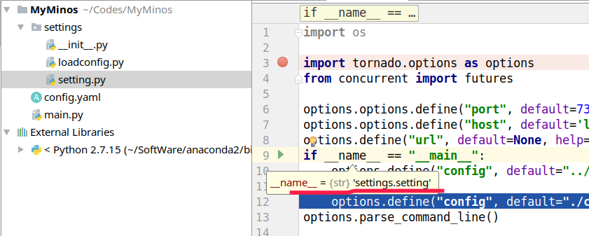

# _ _ name _ _==_ _ main _ _

## 首先

**python作为一个顺序执行的语言。**

__name__是所有模块都会有的一个内置属性，一个模块的__name__值取决于你如何应用模块。

1. 如果外部（别的包） import 一个模块，那么模块__name__ 的值通常为**模块文件名**，不带路径或者文件扩展名。
2. 如果模块自身运行自己模块内部的内容，__name__ 的值将是一个特别缺省"__main__"。从而用if __name__ == '__main__'来判断是否是在直接运行该.py文件！
3. 如果A模块被B模块import后，A模块内的__name__就是模块的名字“A”，而不是__main__，因此在B import A 并执行A模块中的代码时，A模块中文件里面 if __name__ == '__main__'中的语句就不会再运行！
4. **如果是同一个包内的文件，调用的话，__name__是对应的py文件的名字，而不是main，只有执行这个文件的时候，当执行到__name__，结果为__main

当main.py import settings.setting的时候，__name__是settings.setting

