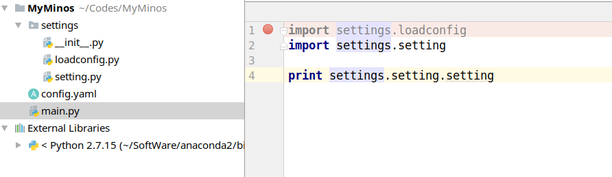

# python包的import机制

在import的时候，就会执行import对应文件的代码，并且算是将代码写入到当前的文件当中一样。比如：

在main.py里面import了settings.setting，当程序运行到这一步的时候，就会执行settings.setting文件，如果此时setting.py文件里面有读取文件的操作，如下图：

这里写的文件的路径就不能是 **../config.yaml**而需要是 **./config.yaml**就好像import的文件被直接添加到了main.py文件里面一样。