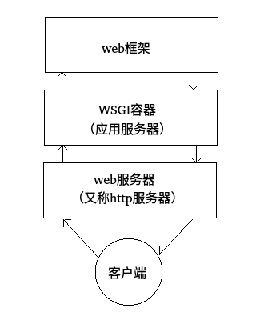

# python web下的服务器结构——WSGI容器、Nginx、Flask之间的关系

python web下的应用结构主要为：

## 客户端：

**浏览器或者app。**

## web服务器

Web服务器是指驻留于因特网上某种类型计算机的程序。当Web浏览器（客户端）连到服务器上并请求文件时，服务器将处理该请求并将文件发送到该浏览器上，附带的信息会告诉浏览器如何查看该文件（即文件类型）。服务器使用HTTP（超文本传输协议）进行信息交流，这就是人们常把它们称为HTTP服务器的原因。

**严格意义上Web服务器只负责处理HTTP协议，用于处理静态页面的内容。而动态内容需要通过WSGI接口交给应用服务器去处理。**

**Web服务器包括Nginx，Apache，IIS等**。而优秀的web服务器在接收http请求时，还可以做负载均衡和反向代理等工作。

## WSGI容器

常见的WSGI容器有Gunicorn，uWSGI等。web框架和web服务器之间需要通信，这时候需要设计一套双方都遵守的借口。PEP3333指出，**WSGI(Web Server Gateway Interface)是WEB服务器和web框架或web应用之间建立的一种简单通用的接口规范**。有了wsgi这份接口规范，在web开发的过程中，能更加自由的选择服务器端和框架；在服务器端和框架的开发过程能够分离开来，不用过多的考虑双方具体的实现，使得服务器端和框架开发者能够专心自己领域的开发工作。而WSGI容器就是根据这套接口写出来的。**WSGI容器的作用就是根据web服务器传递而来的参数构建一个让WSGI应用成功执行的环境**，例如request，而且还得把WSGI应用上处理好的结果返回给web服务器。此外WSGI容器也叫应用服务器。

注： 一般应用服务器都集成了web服务器，主要是为了调试方便，出于性能和稳定性考虑，并不能在生产环境中使用。 

## web框架

作用主要是方便我们开发 web应用程序，HTTP请求的动态数据就是由 web框架层来提供的。常见的 **web框架有Flask，Django，Tornado**等，而**Tornado不光是一个web框架，还实现了WSGI容器的功能。**

## web应用程序

web应用程序应该就是使用web框架写出来的应用程序，就是在写路由的时候，后面的那个类吧

## 补充记录

都知道Flask是一个web框架，而且Flask是基于werkzeug开发的，那werkzeug是什么呢？

Werkzeug是一个WSGI工具包，他可以作为一个Web框架的底层库。这里稍微说一下， werkzeug 不是一个web服务器，也不是一个web框架，而是一个工具包，官方的介绍说是一个 WSGI 工具包，它可以作为一个 Web 框架的底层库，因为它封装好了很多 Web 框架的东西，例如 Request，Response 等等。使用它可以减轻web框架开发工作量。我看过werkzeug的源码后发现，werkzeug也实现了WSGI容器的功能，而且利用python/http/server.py库实现了一个简易的http服务器。因此在调试的时候可以直接使用app.run()把服务器给运行起来。
